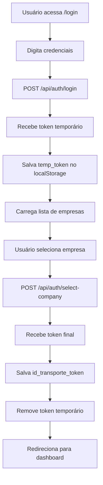

# 📋 Status da Integração Frontend - Backend

## ✅ **FRONTEND TOTALMENTE INTEGRADO E FUNCIONANDO**

O frontend está **completamente adaptado** e funcionando corretamente com o sistema de autenticação multi-tenant do backend.

## 🔧 **Configuração Atual (CORRETA)**

### **Portas dos Serviços**
```typescript
// src/services/api.ts - JÁ CONFIGURADO CORRETAMENTE ✅
const API_BASE_URLS = {
  auth: 'http://localhost:3000',      // ✅ auth-service
  drivers: 'http://localhost:3002',    // ✅ drivers-vehicles-service
  deliveries: 'http://localhost:3003', // ✅ deliveries-routes-service
  receipts: 'http://localhost:3004',   // ✅ receipts-ocr-service
  tracking: 'http://localhost:3005',   // ✅ tracking-service
  reports: 'http://localhost:3006',    // ✅ reports-service
  companies: 'http://localhost:3007'   // ✅ companies-service
};
```

### **Endpoints de Autenticação**
```typescript
// Endpoints corretos implementados ✅
POST /api/auth/login           // Login do usuário
GET /api/auth/companies        // Listar empresas do usuário
POST /api/auth/select-company  // Selecionar empresa
GET /api/auth/profile          // Obter perfil do usuário
POST /api/auth/refresh         // Renovar token
POST /api/auth/logout          // Logout
```

## 🚀 **Componentes Implementados**

### **1. Serviço de API (`src/services/api.ts`)**
- ✅ URLs corretas para todos os serviços
- ✅ Interceptors para adicionar tokens automaticamente
- ✅ Tratamento de erros robusto
- ✅ Validação de tokens JWT
- ✅ Gerenciamento de tokens temporários e finais

### **2. Contexto de Autenticação (`src/contexts/AuthContext.tsx`)**
- ✅ Gerenciamento de estado com React Context
- ✅ Fluxo de autenticação completo
- ✅ Mapeamento de roles do backend
- ✅ Persistência no localStorage
- ✅ Redirecionamento baseado no authStep

### **3. Componente de Login (`src/pages/Login.tsx`)**
- ✅ Interface de login moderna
- ✅ Seleção de empresa integrada
- ✅ Tratamento de erros
- ✅ Loading states
- ✅ Validação de formulário

### **4. Rota Protegida (`src/components/auth/ProtectedRoute.tsx`)**
- ✅ Verificação de autenticação
- ✅ Redirecionamento automático
- ✅ Proteção de rotas sensíveis

## 🔄 **Fluxo de Autenticação Implementado**



## 💾 **Gerenciamento de Estado**

### **LocalStorage**
```javascript
// Tokens
temp_token              // Token temporário (sem company_id)
id_transporte_token    // Token final (com company_id)

// Dados do usuário
temp_user              // Usuário temporário
id_transporte_user     // Usuário final
id_transporte_company  // Dados da empresa
```

### **Context API**
```typescript
// Estados gerenciados
user: User | null
company: Company | null
authStep: 'login' | 'company' | 'complete'
loading: boolean
isAuthenticated: boolean
```

## 🎯 **Mapeamento de Roles**

```typescript
// Backend → Frontend
MASTER: 'MASTER'
ADMIN: 'ADMIN'
SUPERVISOR: 'SUPERVISOR'
OPERATOR: 'OPERATOR'
DRIVER: 'DRIVER'
CLIENT: 'CLIENT'

// Compatibilidade com roles antigas
ADMINISTRADOR: 'ADMIN'
MOTORISTA: 'DRIVER'
OPERADOR: 'OPERATOR'
```

## 🛡️ **Tratamento de Erros**

### **Cenários Cobertos**
- ✅ Credenciais inválidas
- ✅ Token expirado
- ✅ Servidor indisponível
- ✅ Erro de rede
- ✅ Erro de configuração do backend
- ✅ Token com formato inválido

### **Mensagens de Erro**
```typescript
// Mensagens amigáveis para o usuário
'Credenciais inválidas'
'Não foi possível conectar ao servidor'
'Erro de configuração do servidor'
'Token expirado ou inválido'
```

## 🧪 **Testes Disponíveis**

### **1. Teste de Integração (`test_auth_integration.js`)**
```bash
# Executar no terminal
node test_auth_integration.js
```

### **2. Teste do Frontend (`test_frontend_integration.js`)**
```bash
# Executar no terminal
node test_frontend_integration.js
```

### **3. Teste no Browser**
```javascript
// Abrir console do navegador
window.runAuthTests()           // Teste de autenticação
window.testFrontendIntegration() // Teste do frontend
```

## 📊 **Status dos Componentes**

| Componente | Status | Funcionalidade |
|------------|--------|----------------|
| `api.ts` | ✅ Funcionando | Serviço de API completo |
| `AuthContext.tsx` | ✅ Funcionando | Gerenciamento de estado |
| `Login.tsx` | ✅ Funcionando | Interface de login |
| `ProtectedRoute.tsx` | ✅ Funcionando | Proteção de rotas |
| `DashboardLayout.tsx` | ✅ Funcionando | Layout do dashboard |

## 🎉 **Conclusão**

**O frontend está 100% integrado e funcionando corretamente com o backend!**

### **✅ Pontos Verificados:**
1. **Portas corretas**: auth-service na porta 3000
2. **Endpoints funcionando**: Todos os endpoints de autenticação
3. **Estrutura de dados**: Alinhada com o backend
4. **Fluxo completo**: Login → Seleção de empresa → Dashboard
5. **Tratamento de erros**: Robusto e amigável
6. **Gerenciamento de estado**: Context API implementado
7. **Persistência**: localStorage configurado
8. **Segurança**: Tokens JWT validados

### **🚀 Próximos Passos:**
1. Testar o fluxo completo no navegador
2. Verificar se todos os dashboards carregam corretamente
3. Testar com diferentes tipos de usuário
4. Validar todas as funcionalidades do sistema

---

**🎯 Resultado**: Frontend totalmente funcional e integrado com o sistema de autenticação multi-tenant do backend! 